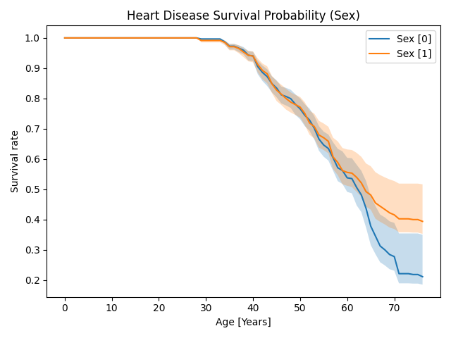

# 📊 Heart disease survival

This is a small project to apply survival models to heart disease data. So far, only models from [XGBoost Survival Embeddings](https://loft-br.github.io/xgboost-survival-embeddings/index.html) (XGBSE) have been implemented, but it already provides valuable insights into the data.

The aim of this project is also to show how to have a solid and reliable software development approach for a data science application which is more TDD and MLOps oriented.

## 📜 Context

Usually, this sort of data science issues are tackled as a classification problem. In the current case, either having heart disease or not. The most influencial feature is by far the age, since the onset of CVD takes years to develop. Unfortunately, this does not provide valuable information for the younger population, since their risk is very low. Instead, it would be much more valuable to know what the risk is in, say, 5, 10 or 20 years' time.

This can be tackled very well by using survival analysis with right censored data. The result is not 0 or 1 but the likelihood of not having heart disease as a function of time —the so-called **survival rates**. Ideally, one would like to make this feature dependent, so that by changing behavior, that is, feature values such as cholesterol, one can see an increase on the survival probability, meaning a reduced risk of suffering a cardiac event in the long run.

## 🎓 Results

The current model, XGBSE' `XGBSEKaplanNeighbors`, uses a tree-based approach  to the calculate the [Kaplan–Meier estimator](https://en.wikipedia.org/wiki/Kaplan–Meier_estimator) of the data points after performing a neighbor search, which is computationally rather expensive. Nonetheless, this approach leads to a **explainable** interpretation of the model by using the built-in feature importance. Moreover, since the model is probability-based, it also provides confidence intervals for the predictions.

An interface for the `XGBSEKaplanTree` has been also implemented.

### 📉 Survival rates

The survival rates for the whole data set look as follows:


*Average predicted survival rates for the whole data set. Confidence interval set to the default of width of 0.683.*

Note that by age 70, the likelihood of not having had a cardiac event is as high as 70%.

Since the data set has been pseudonimized, it's unclear which gender is which, but one can still see differences between the two of them:



*Average predicted survival rates for the whole data set depending on the sex [0,1]. Confidence interval set to the default of width of 0.683.*


### ✅ Performance

To evaluate the model's performance, we use the [Integrated Brier Score](https://scikit-survival.readthedocs.io/en/stable/api/generated/sksurv.metrics.integrated_brier_score.html), the go-to metric for surival analysis, which resembles the MSE when the target time-series is a probability-like function. Thus, a natural threshold for this metric is 0.25, correponding to a random (50/50 chance) between two events, in this case, having or not heart disease.

We used two different implementations of the IBS, the built-in from `XGBSE` and the one from `scikit-survival` and a train/validation split of 20%. This lead to

| Model | Metric | Train | Validation |
|---|---|---|---|
|`XGBSEKaplanNeighborsModel`|IBS (XGBSE)|0.035|0.046|
|`XGBSEKaplanNeighborsModel`|IBS (SKSurv)|0.055|0.072|

As one can see, the model performs very well according to the IBS metric.

### 📖 Explainability

As mentioned above, the current model provides some sort of interpretation based on the [feature importance](https://xgboost.readthedocs.io/en/latest/python/python_api.html#xgboost.Booster.get_score). The values obtained are

| Model | Feature | Score |
|---|---|---|
|`XGBSEKaplanNeighborsModel`|              chol|586|
|`XGBSEKaplanNeighborsModel`|           thalach|512|
|`XGBSEKaplanNeighborsModel`|max_theoretical_hr|501|
|`XGBSEKaplanNeighborsModel`|           oldpeak|344|
|`XGBSEKaplanNeighborsModel`|          trestbps|323|
|`XGBSEKaplanNeighborsModel`|                cp|226|
|`XGBSEKaplanNeighborsModel`|             slope|115|
|`XGBSEKaplanNeighborsModel`|           restecg| 89|
|`XGBSEKaplanNeighborsModel`|               sex| 84|
|`XGBSEKaplanNeighborsModel`|              thal| 82|
|`XGBSEKaplanNeighborsModel`|                ca| 54|
|`XGBSEKaplanNeighborsModel`|             exang| 24|


## ⚙️ How to

These are the steps one needs to do to run the main entry point, `entry.py`.

### 💾 Data set

First, download the main CSV file from the [source](https://www.kaggle.com/datasets/johnsmith88/heart-disease-dataset/). The version being used dates to the end of December 2023. Once the file has been downloaded, clone the repository and added to `data/csv` as `heart.csv`.

### 📦 Install the virtual environment

Make sure you have Python installed and the package `Poetry`. Otherwise, you can install it by running:

```commandline
pip install poetry
```

You can verify the installation by running:
```commandline
poetry --version
```

Once this is in place, make sure that `Poetry` installs the virtual environment in the project folder and install it (including test and dev dependencies):

```commandline
poetry config virtualenvs.in-project true
cd heart-disease-survival
poetry install --with dev,test
```

You can also install the pre-commit hooks:

```commandline
pre-commit install
```

These include creating the requirements, checking for code formatting and running the tests before committing.

Now you are set to develop and execute the program:

```commandline
poetry run python entry.py
```

To ease running the entry point with parameters, we use [fire](https://google.github.io/python-fire/guide/) to pass them as arguments, e.g.:

```commandline
poetry run python entry.py --use-cached True
```

#### 🗒️ Note
If you don't want to install `Poetry`, the requirements to run the program are also available, so you can just run:

```commandline
pip install -r requirements.txt
```

## 🏗️ Future work

In the future, other libraries should be added and then compare the different models. These are some of which would be worth exploring:

- [PySurvival](https://square.github.io/pysurvival/intro.html)
- [Lifelines](https://lifelines.readthedocs.io/en/latest/)
- [PyCox](https://github.com/havakv/pycox)